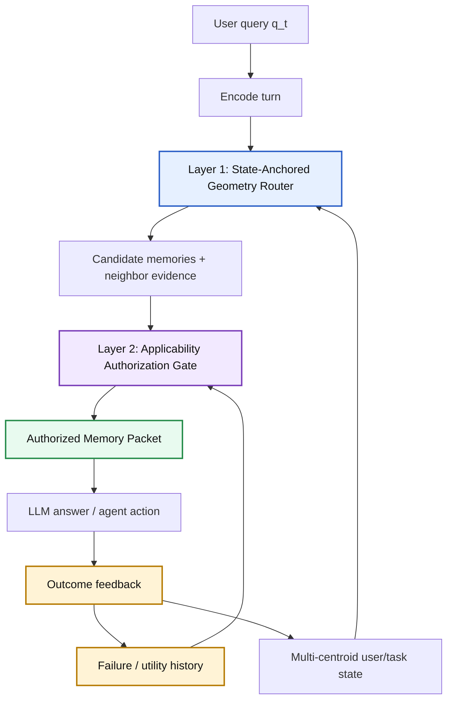
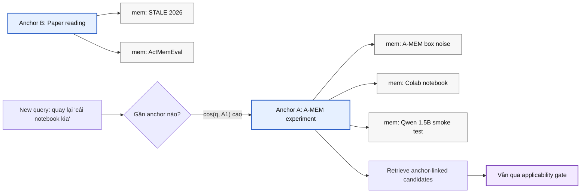
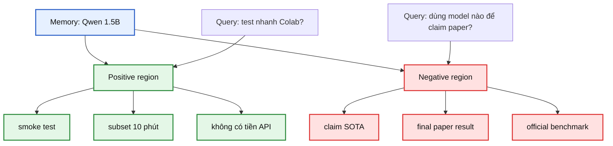
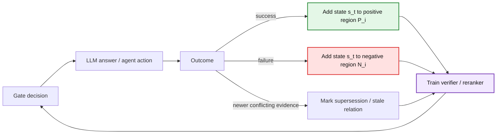

# SAC-Mem: State-Anchored Memory Authorization

## Hướng A*: bộ nhớ agent không chỉ retrieve, mà phải biết memory nào được phép tác động

**Tên hướng:** State-Anchored Counterfactual Memory Authorization  
**Tên ngắn:** SAC-Mem / CAR-Mem  
**Thông điệp:** Geometry định tuyến trạng thái. Gate cấp quyền sử dụng memory. Failure memory dạy agent điều không nên lặp lại.

---

# 1. Motivation: memory agent đang sai ở đâu?

Các hệ memory agent hiện nay thường làm:

```text
user query -> retrieve memory gần nhất -> đưa vào prompt -> LLM trả lời / hành động
```

Vấn đề không nằm ở việc **không tìm thấy memory**. Nhiều khi hệ tìm được memory liên quan, nhưng dùng sai vai trò.

Ví dụ:

| Memory | Relevant? | Có nên dùng làm premise hiện tại? |
|---|---:|---:|
| "2024: văn phòng ở Boston" | Có | Không, nếu đã có update mới |
| "2026: văn phòng chuyển sang Seattle" | Có | Có |
| "Qwen 1.5B tốt cho smoke test rẻ" | Có | Không, nếu đang claim SOTA |
| "Deploy lần trước crash vì OS cũ" | Có | Có, nhưng dưới dạng cảnh báo |

**Insight:** Memory gần nghĩa chưa chắc là memory được phép dùng.

---

# 2. Gap: relevance khác applicability

Retrieval trả lời:

```text
Memory này có liên quan tới câu hỏi không?
```

Nhưng agent cần trả lời:

```text
Memory này có được quyền ảnh hưởng tới câu trả lời hoặc hành động hiện tại không?
```

Sai lầm lõi của long-term memory:

```text
high relevance != valid premise
```

Chúng ta không thay toàn bộ memory agent. Ta thêm một lớp có thể cắm vào nhiều hệ:

```text
retrieval system -> state router -> applicability authorization -> prompt/action
```

---

# 3. Failure case: bẫy memory cũ

```mermaid
flowchart LR
    Q["Query: Văn phòng hiện tại ở đâu?"] --> R["Retriever"]
    R --> M1["m_old: 2024 Boston"]
    R --> M2["m_new: 2026 Seattle"]
    R --> M3["m_noise: từng đi Boston"]
    M1 --> P["Raw prompt"]
    M2 --> P
    M3 --> P
    P --> L["LLM"]
    L --> W["Có nguy cơ trả lời Boston hoặc lẫn lộn"]

    classDef bad fill:#ffe1e1,stroke:#d33,stroke-width:2px,color:#111;
    classDef good fill:#e4f7e7,stroke:#2a8a3a,stroke-width:2px,color:#111;
    classDef warn fill:#fff3c4,stroke:#aa7a00,stroke-width:2px,color:#111;
    class M1,bad;
    class M2,good;
    class M3,warn;
    class W,bad;
```

Top-k hoặc A-MEM-style box có thể tăng recall, nhưng cũng kéo memory cũ/nhiễu vào prompt.

**Vấn đề A\* nên đánh:** không chỉ retrieve đúng, mà phải kiểm soát memory nào được phép trở thành premise.

---

# 4. Research question

**Câu hỏi nghiên cứu chính:**

```text
Can long-term agents learn when a memory is applicable,
not merely relevant, under a changing user/task state?
```

Tách thành 3 câu hỏi nhỏ:

1. Làm sao biết user đang ở state/topic nào?
2. Làm sao biết memory này từng hữu ích hoặc từng gây lỗi ở state nào?
3. Làm sao cấp quyền `APPLY / SUPPORT / WARNING / STALE` trước khi memory vào prompt?

Mục tiêu không phải một heuristic gate.

Mục tiêu là một **memory-use policy** học được.

---

# 5. Core thesis

Ta xem mỗi memory là một đối tượng có điều kiện áp dụng:

```text
Memory = content + state regions + validity + utility + failure history
```

Một memory không phải fact tĩnh.

Nó có:

- vùng trạng thái nơi nó giúp agent;
- vùng trạng thái nơi nó gây lỗi;
- quan hệ bị thay thế bởi memory mới;
- phạm vi áp dụng;
- confidence và provenance.

**Thesis:**  

```text
A memory should be retrieved by relevance,
but used only inside its learned applicability region.
```

---

# 6. Kiến trúc 2 layer



Nguyên tắc:

```text
Geometry không phán memory đúng/sai.
Geometry chỉ định tuyến và phát hiện state.
Gate mới quyết định memory được dùng thế nào.
```

---

# 7. Layer 1: State-Anchored Geometry Router

Không nén user thành một vector duy nhất.

Ta giữ nhiều tâm trạng thái:

```text
U = {mu_project, mu_budget, mu_model, mu_dataset, mu_style, mu_failure, ...}
```

Trạng thái hoạt động hiện tại:

```text
s_t = active user/task state
```

Vector search:

```text
v_search = alpha * emb(q_t) + (1 - alpha) * s_t
```

Router nhận diện:

```text
CONTINUE: tiếp tục topic hiện tại
SHIFT: chuyển sang topic mới
RETURN: quay lại một anchor cũ
```

Lợi ích: xử lý query mơ hồ như "cái này", "nó", "method đó", "chạy được không".

---

# 8. State anchor: quay lại topic cũ mà không hồi sinh context cũ



Không restore toàn bộ snapshot cũ.  
Chỉ dùng anchor để route retrieval, rồi mọi memory vẫn phải được gate kiểm tra.

---

# 9. Layer 2: Applicability Authorization Gate

Gate nhận:

```text
query q_t
active state s_t
candidate memory m_i
neighbor evidence
timestamp / source / confidence
positive-negative history
```

Gate trả về:

```json
{
  "label": "APPLY",
  "usable_as_premise": true,
  "confidence": 0.87,
  "reason": "This is the latest office-location update."
}
```

Nhãn chính:

| Label | Vai trò |
|---|---|
| APPLY | được dùng làm premise |
| SUPPORT | chỉ làm background |
| WARNING | cảnh báo/failure/constraint |
| STALE | từng đúng nhưng đã lỗi thời |
| CONTRADICTED | bị evidence khác phủ định |
| UNCERTAIN | chưa đủ chắc |
| IRRELEVANT | bỏ |

---

# 10. Counterfactual Applicability Region

Mỗi memory lưu hai vùng:

```text
P_i = positive contexts where memory helped
N_i = negative contexts where memory failed
```

Applicability score:

```text
A(m_i, q_t, s_t)
= relevance(q_t, m_i)
+ closeness(s_t, P_i)
- closeness(s_t, N_i)
- conflict(m_i)
- token_cost(m_i)
```

Hay dưới góc nhìn utility:

```text
EU(use m_i)
= P(success | q_t, s_t, m_i) * reward
- P(failure | q_t, s_t, m_i) * harm
- token_cost
```

Điểm mới: memory học được **nó nên dùng ở đâu** và **không nên dùng ở đâu**.

---

# 11. Minh họa: memory có vùng đúng và vùng sai

Memory:

```text
"Dùng Qwen 1.5B để chạy Colab nhanh, rẻ."
```



Cùng một memory, nhưng quyết định khác nhau theo state.

---

# 12. Failure memory: nhớ cả điều không nên lặp lại

Failure memory không phải noise. Nó là negative evidence.

```json
{
  "type": "FAILURE",
  "attempted_action": "deploy Alpha update",
  "failure_cause": "Production server was Ubuntu 18.04; Python 3.11 unsupported.",
  "avoid_condition": "Do not deploy before OS/runtime upgrade.",
  "recovery": "Upgrade OS or use compatible runtime.",
  "label_when_retrieved": "WARNING"
}
```

Khi query gần failure region:

```text
Gate không dùng failure như fact chính.
Gate đưa nó vào warning block để tránh lặp lỗi.
```

Đây là cầu nối với agentic task: memory không chỉ giúp trả lời, mà giúp hành động không sai.

---

# 13. Authorized Memory Packet

Raw memory prompt:

```text
Đưa tất cả memory gần nghĩa vào prompt.
```

SAC-Mem packet:

```text
AUTHORIZED MEMORY PACKET

Applicable facts:
- facts được phép làm premise

Support-only background:
- bối cảnh phụ, không tự quyết định

Warnings / failure memories:
- điều cần tránh, lỗi từng xảy ra

Invalidated historical premises:
- memory cũ không được dùng như fact hiện tại

Uncertain:
- cần hỏi lại hoặc giảm confidence
```

Packet này biến memory từ text thô thành bằng chứng có vai trò.

---

# 14. Learning loop: từ gate thủ công sang policy học được



Prototype có thể bắt đầu bằng heuristic/LLM judge.  
Hướng A* phải đi tới verifier học được:

```text
(q_t, s_t, memory, evidence) -> authorization label + confidence
```

---

# 15. Evaluation cho aim A*

Không đủ nếu chỉ test synthetic nhỏ.

Cần benchmark hoặc protocol đánh vào 4 failure mode:

| Failure mode | Cần đo |
|---|---|
| Stale memory | stale premise leak, SR/PR/IPA |
| Topic shift | shift accuracy, wrong-anchor retrieval |
| Return to topic | return-anchor recall, answer accuracy |
| Failure replay | repeat failure rate, action success |

Baseline cần so:

```text
raw top-k
A-MEM / A-MEM-style box
Mem0 / graph memory nếu có
LLM reranker
oracle upper bound
SAC-Mem without state
SAC-Mem without failure region
```

Claim A* cần chứng minh module này plug-in được, không chỉ thắng trong một toy setup.

---

# 16. Contribution nhắm A*

Đóng góp mong muốn:

1. **Formulation:** memory use là state-conditioned authorization, không phải retrieval.
2. **Architecture:** State-Anchored Router + Applicability Gate.
3. **Model:** Counterfactual Applicability Region cho positive/negative memory use.
4. **Learning:** outcome feedback cập nhật vùng áp dụng và vùng thất bại.
5. **Benchmark/Eval:** stale, topic return, failure replay, token/noise/action success.
6. **Plug-in:** gắn được vào A-MEM, RAG, graph memory, Mem0-style pipelines.

Câu chốt:

```text
Relevance finds memory.
State geometry finds the right region.
Authorization decides whether memory may influence the agent.
Failure memory prevents repeated mistakes.
```

