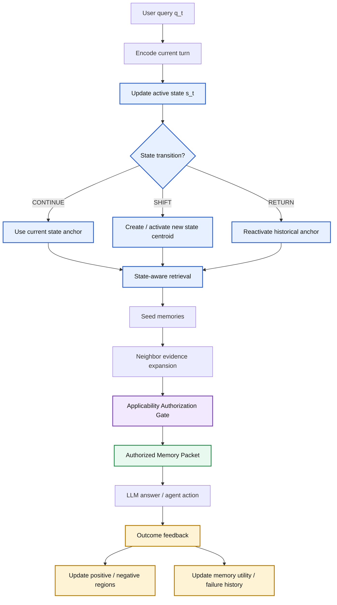
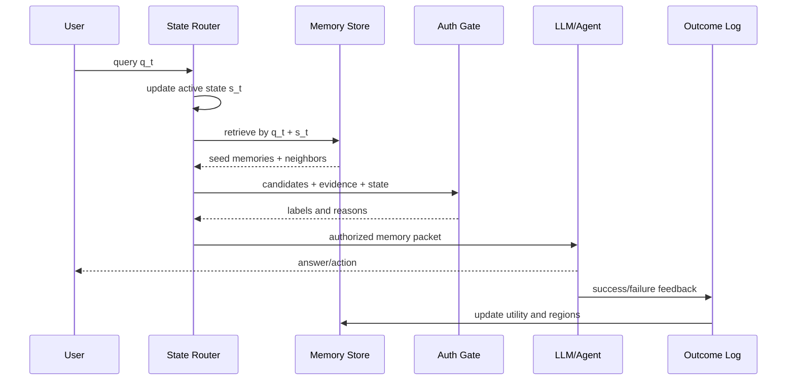
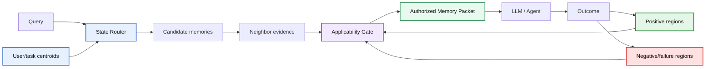

# SAC-Mem Detailed Explainer

## State-Anchored Counterfactual Memory Authorization cho long-term memory agents

Tài liệu này giải thích chi tiết ý tưởng trong slide `sac_mem_a_star_vision_vi.md`.

Mục tiêu không phải mô tả prototype hiện tại, mà là mô tả hướng nghiên cứu ta muốn đi tới nếu aim bài mạnh/A*:

```text
Memory agent không chỉ cần retrieve memory đúng.
Nó cần biết memory nào được phép tác động vào câu trả lời hoặc hành động hiện tại.
```

---

## 1. Tóm tắt một câu

SAC-Mem coi memory là một đối tượng có điều kiện áp dụng:

```text
Memory được retrieve theo relevance,
nhưng chỉ được dùng nếu nó được authorize theo state hiện tại của user/task.
```

Nói ngắn:

```text
Relevance finds memory.
State geometry finds the right region.
Applicability authorization decides whether memory may influence the agent.
Failure memory prevents repeated mistakes.
```

---

## 2. Vì sao cần hướng này?

Các hệ memory agent phổ biến thường có pipeline:

```text
query -> retrieve top-k memories -> maybe expand neighbor memories -> prompt -> LLM answer/action
```

Pipeline này có một giả định ngầm:

```text
Memory nào được retrieve thì có thể đưa vào prompt.
```

Giả định này sai trong long-term memory.

Một memory có thể:

- rất liên quan nhưng đã lỗi thời;
- đúng trong quá khứ nhưng không đúng hiện tại;
- đúng ở một scope khác nhưng không đúng scope hiện tại;
- hữu ích cho smoke test nhưng không đủ cho paper claim;
- từng gây lỗi trong state tương tự;
- chỉ nên làm background, không nên làm premise hành động.

Vấn đề không còn là:

```text
Can we retrieve relevant memories?
```

Mà là:

```text
Can we decide which retrieved memories are allowed to influence the agent now?
```

---

## 3. Ví dụ trực giác

### 3.1. Memory cũ nhưng relevant

Memory store:

```text
m1: 2024-03-10: Văn phòng của user ở Boston.
m2: 2026-02-18: User đã chuyển văn phòng hiện tại sang Seattle thay vì Boston.
m3: 2025-06-02: User từng đi Boston gặp khách hàng.
```

Query:

```text
Văn phòng hiện tại của user ở đâu?
```

Nếu dùng top-k:

```text
m1, m2, m3 đều có thể được retrieve vì cùng nói về Boston/Seattle/office.
```

Nhưng vai trò đúng phải là:

```text
m2 = APPLY
m1 = STALE
m3 = SUPPORT_ONLY hoặc IRRELEVANT
```

Vậy memory `m1` relevant nhưng không được phép làm premise.

### 3.2. Memory đúng nhưng sai scope

Memory:

```text
"Qwen 1.5B phù hợp để chạy smoke test rẻ trên Colab."
```

Query A:

```text
Tôi muốn test nhanh 10 phút trên Colab, dùng model gì?
```

Label đúng:

```text
APPLY
```

Query B:

```text
Tôi muốn claim SOTA trong paper, dùng model gì?
```

Label đúng:

```text
WARNING hoặc SUPPORT_ONLY
```

Cùng một memory, nhưng state khác nhau thì quyền sử dụng khác nhau.

---

## 4. Core idea

Ta thêm 2 layer:

```text
Layer 1: State-Anchored Geometry Router
Layer 2: Applicability Authorization Gate
```

Ý nghĩa:

- Layer 1 xác định user/task đang ở vùng trạng thái nào.
- Layer 1 giúp retrieve candidate memory đúng vùng.
- Layer 2 kiểm tra từng memory có được dùng không.
- Memory không vào prompt dưới dạng raw text nữa.
- Memory vào prompt dưới dạng packet có vai trò rõ ràng.

---

## 5. Tổng quan pipeline



Điểm quan trọng:

```text
Neighbor box chỉ là evidence cho gate.
Neighbor box không tự động đi vào prompt.
```

Đây là khác biệt lớn với kiểu A-MEM-style expansion.

---

## 6. Layer 1: State-Anchored Geometry Router

### 6.1. Không dùng một user vector duy nhất

User không nên được nén thành một vector đơn.

Một user có nhiều facet:

```text
project đang làm
budget constraint
model preference
dataset đang test
ngôn ngữ trình bày
paper target
failure history
```

Ta biểu diễn user/task bằng nhiều centroid:

```text
U = {mu_project, mu_budget, mu_model, mu_dataset, mu_style, mu_failure, ...}
```

Ở mỗi thời điểm, hệ giữ active state:

```text
s_t = active user/task state
```

### 6.2. Search vector kết hợp query và state

Thay vì retrieve bằng query đơn:

```text
v_query = emb(q_t)
```

Ta retrieve bằng:

```text
v_search = alpha * emb(q_t) + (1 - alpha) * s_t
```

Nếu query rõ ràng, tăng `alpha`.

Nếu query mơ hồ kiểu "cái này", "nó", "method đó", giảm `alpha`, dựa nhiều hơn vào state.

### 6.3. State transition

Router phát hiện 3 trạng thái:

```text
CONTINUE: user tiếp tục topic hiện tại
SHIFT: user chuyển sang topic mới
RETURN: user quay lại topic cũ
```

Logic khái niệm:

```text
if near current centroid:
    CONTINUE
elif near historical anchor:
    RETURN
else:
    SHIFT
```

Nhưng lưu ý:

```text
Vector drift không chứng minh memory cũ sai.
Vector drift chỉ báo rằng cần route hoặc verify lại.
```

---

## 7. State anchor

State anchor là snapshot nhẹ của một vùng hội thoại/task.

Ví dụ:

```json
{
  "anchor_id": "aamem_colab_experiment",
  "centroid": "...",
  "topic": "AAMem Colab experiment",
  "active_constraints": [
    "small local model",
    "no big API budget",
    "quick subset first",
    "compare with 2026 baselines later"
  ],
  "linked_memory_ids": ["m_model_budget", "m_notebook_runner", "m_stale_metrics"]
}
```

Khi user quay lại:

```text
"cái notebook kia chạy lại thế nào?"
```

Router phát hiện query gần anchor `aamem_colab_experiment`.

Nhưng hệ không restore nguyên context cũ.

Nó làm:

```text
RETURN -> retrieve from anchor-linked region -> pass through gate
```

Lý do:

```text
Context cũ có thể stale.
Anchor chỉ định tuyến, không cấp quyền sử dụng.
```

---

## 8. Layer 2: Applicability Authorization Gate

Gate nhận:

```text
query q_t
active state s_t
candidate memory m_i
neighbor evidence
timestamp / source / confidence
positive-negative history
```

Gate trả:

```json
{
  "memory_id": "m_42",
  "label": "APPLY",
  "usable_as_premise": true,
  "confidence": 0.87,
  "reason": "This is the newest memory about current office location."
}
```

Nhãn chính:

| Label | Ý nghĩa | Có vào prompt không? |
|---|---|---|
| `APPLY` | được dùng làm premise hiện tại | Có, trong applicable facts |
| `SUPPORT` | chỉ làm background | Có, nhưng không tự quyết định |
| `WARNING` | failure/risk/constraint cần tránh | Có, trong warning block |
| `STALE` | từng đúng nhưng đã lỗi thời | Có thể vào invalidated block hoặc bỏ |
| `CONTRADICTED` | bị evidence khác phủ định | Có thể vào invalidated block |
| `UNCERTAIN` | chưa đủ chắc | Có thể yêu cầu hỏi lại |
| `IRRELEVANT` | không liên quan | Bỏ |

---

## 9. Memory as Conditional Applicability Region

Đây là phần cần đẩy mạnh nếu aim A*.

Ta không coi memory là:

```text
content + embedding
```

Mà coi memory là:

```text
content + positive region + negative region + relations + utility
```

Với mỗi memory `m_i`:

```text
P_i = vùng state nơi memory từng giúp agent
N_i = vùng state nơi memory từng gây lỗi hoặc không nên dùng
```

Applicability:

```text
A(m_i, q_t, s_t)
= relevance(q_t, m_i)
+ closeness(s_t, P_i)
- closeness(s_t, N_i)
- conflict(m_i)
- token_cost(m_i)
```

Góc nhìn expected utility:

```text
EU(use m_i)
= P(success | q_t, s_t, m_i) * reward
- P(failure | q_t, s_t, m_i) * harm
- token_cost(m_i)
```

Điểm mới:

```text
Memory học được nó nên dùng ở đâu và không nên dùng ở đâu.
```

---

## 10. Failure memory

Failure memory là memory loại đặc biệt.

Nó không chỉ lưu sự kiện thất bại, mà lưu:

- action đã thử;
- nguyên nhân lỗi;
- điều kiện cần tránh;
- cách recover;
- state nơi lỗi xảy ra;
- memory nào đã góp phần gây lỗi, nếu có.

Ví dụ:

```json
{
  "id": "fail_deploy_alpha_001",
  "type": "FAILURE",
  "attempted_action": "deploy Alpha update",
  "failure_cause": "Production server was Ubuntu 18.04; Python 3.11 unsupported.",
  "avoid_condition": "Do not deploy before OS/runtime upgrade.",
  "recovery": "Upgrade OS or use compatible runtime.",
  "negative_region": ["deploy_latest_update", "prod_server_old_os"],
  "label_when_retrieved": "WARNING"
}
```

Khi query gần state đó:

```text
Gate đưa failure memory vào warning block.
```

Không phải để model trả lời dài dòng về lỗi cũ, mà để tránh lặp lại action sai.

---

## 11. Authorized Memory Packet

Thay vì prompt raw top-k:

```text
[memory 1]
[memory 2]
[memory 3]
...
```

Ta đóng gói:

```text
AUTHORIZED MEMORY PACKET

Applicable facts:
- Những memory được phép dùng làm premise.

Support-only background:
- Bối cảnh phụ, không được tự quyết định.

Warnings / failure memories:
- Lỗi, rủi ro, constraint cần tránh.

Invalidated historical premises:
- Memory cũ không được dùng như fact hiện tại.

Uncertain:
- Memory cần xác minh hoặc cần hỏi lại.
```

Mục tiêu:

```text
LLM không phải tự đoán vai trò của memory.
Gate nói rõ memory nào có quyền tác động.
```

---

## 12. Read-time pipeline chi tiết

Khi user hỏi một câu mới:

```text
1. Encode query q_t.
2. Update active state s_t.
3. Detect CONTINUE / SHIFT / RETURN.
4. Build v_search = alpha*q_t + (1-alpha)*s_t.
5. Retrieve seed memories.
6. Expand neighbor evidence, but do not put all neighbors into prompt.
7. For each candidate memory:
   - compute relevance
   - check temporal/source/scope
   - check positive/negative region
   - check stale/conflict/supersession
   - estimate token value
8. Gate assigns label.
9. Build Authorized Memory Packet.
10. LLM answers or agent acts.
11. Log outcome for future learning.
```

Diagram:



---

## 13. Write-time pipeline chi tiết

Sau một interaction, hệ quyết định ghi gì:

```text
1. Extract candidate facts, constraints, preferences, failures.
2. Check novelty against existing memory.
3. Check whether new memory updates or supersedes old memory.
4. Attach source/provenance/confidence.
5. Add relation:
   - supports
   - contradicts
   - supersedes
   - same_topic
   - caused_failure
6. Update state anchor if current topic is stable.
7. Update positive/negative applicability region based on outcome.
```

Không ghi mọi thứ như fact mới.

Một event có thể tạo:

```text
new fact
new constraint
new failure memory
new relation
new state anchor
update to existing memory
```

---

## 14. Schema khái niệm

Không nên schema-free hoàn toàn. Ta cần core schema ổn định để debug và eval.

```json
{
  "id": "m_001",
  "content": "Qwen 1.5B is suitable for cheap Colab smoke tests.",
  "type": "preference_or_constraint",
  "scope": "project:aamem_lab",
  "timestamp": "2026-06-18",
  "status": "active",
  "confidence": 0.86,
  "source_event_ids": ["evt_123"],
  "embedding": "...",
  "relations": [
    {"type": "supports", "target": "m_002"},
    {"type": "not_sufficient_for", "target": "claim:sota"}
  ],
  "applicability": {
    "positive_region_ids": ["reg_smoke_test_low_budget"],
    "negative_region_ids": ["reg_final_sota_claim"],
    "utility_score": 0.42
  },
  "attributes": {
    "key_point": "cheap smoke-test model",
    "critical_condition": "subset run, low budget, Colab",
    "warning": "not enough for final SOTA claim"
  }
}
```

Dynamic schema chỉ nên nằm trong `attributes`.

Core schema không nên thay đổi lung tung.

---

## 15. Ví dụ chạy end-to-end: model Colab

Memory store:

```text
m1: User wants to test 1B-8B local models first due to budget.
m2: Qwen 1.5B is cheap for quick Colab smoke test.
m3: Qwen 7B is stronger but may need L4/A100 or quantization.
m4: Smoke-test subset is not enough for SOTA claim.
m5: Official STALE/ActMem needed for paper-level comparison.
```

Query:

```text
"Cái này mang lên Colab chạy được không, dùng model nào để ra kết quả?"
```

State Router:

```text
active state = AAMem experiment / Colab / small model / eval
transition = CONTINUE
```

Gate:

```text
m1 -> SUPPORT
m2 -> APPLY for quick run
m3 -> SUPPORT for follow-up
m4 -> WARNING
m5 -> WARNING / REQUIREMENT
```

Packet:

```text
Applicable facts:
- Qwen 1.5B is suitable for a quick Colab smoke run.

Support:
- Qwen 7B is a stronger follow-up if GPU allows.

Warnings:
- Do not claim SOTA from smoke subset.
- Official STALE/ActMem protocol is needed for paper-level comparison.
```

Output đúng:

```text
Chạy được. Dùng Qwen 1.5B để smoke test nhanh; dùng Qwen 3B/7B hoặc official benchmark cho result nghiêm túc.
```

---

## 16. Ví dụ chạy end-to-end: stale memory

Memory store:

```text
m_old: 2024: office is Boston.
m_new: 2026: office moved to Seattle instead of Boston.
m_noise: user visited Boston for a client meeting.
```

Query:

```text
"Where is the user's current office?"
```

Router:

```text
state = user_profile.current_office
retrieve office-location cluster
```

Gate:

```text
m_new -> APPLY
m_old -> STALE, superseded_by=m_new
m_noise -> IRRELEVANT or SUPPORT_ONLY
```

Packet:

```text
Applicable facts:
- Current office is Seattle.

Invalidated historical premises:
- Boston was an old office memory and must not be used as current.

Support-only:
- Boston client visit is unrelated to current office.
```

Output đúng:

```text
The current office is Seattle. The Boston memory is historical/stale.
```

---

## 17. Liên hệ với các paper hiện tại

Các paper hiện tại đã chạm từng phần:

| Hướng | Họ làm gì | Khoảng trống của ta |
|---|---|---|
| STALE/CUPMem | active/stale/unknown state, premise resistance | chưa có geometry router + positive/negative applicability region |
| ActMem | memory for action, causal/semantic graph | chưa explicit per-memory authorization packet |
| MemRL | utility/Q-value cho memory | chưa state-conditioned applicability label |
| DeltaMem | failure-penalized experience reuse | chưa làm gate cấp quyền memory trước prompt |
| A-MEM | linked memory / zettelkasten expansion | thiếu authorization trước khi đưa box vào prompt |
| MemoryArena/MemGym | benchmark agentic memory | chủ yếu đo, không phải method authorization |

Position tốt nhất:

```text
Các bài hiện tại giải quyết từng lát cắt.
SAC-Mem thống nhất chúng dưới một memory-use policy:
memory được retrieve theo relevance nhưng được dùng theo state-conditioned authorization.
```

---

## 18. Metric cần đo

### Retrieval/context

```text
evidence_recall
evidence_precision
noise_rate
avg_context_tokens
```

### Stale/applicability

```text
fresh_memory_hit
stale_premise_leak
stale_answer_leak
SR / PR / IPA accuracy
```

### State routing

```text
topic_shift_accuracy
return_to_anchor_accuracy
wrong_anchor_rate
state-conditioned retrieval precision
```

### Failure memory

```text
repeat_failure_rate
warning_precision
action_success_rate
failure_avoidance_gain
```

### Learned gate

```text
authorization_label_f1
APPLY precision
STALE recall
WARNING precision
calibration error
```

---

## 19. Ablation bắt buộc nếu aim A*

Không thể chỉ show một method thắng.

Cần ablation:

```text
SAC-Mem full
SAC-Mem without state router
SAC-Mem without positive/negative regions
SAC-Mem without failure memory
SAC-Mem without neighbor evidence
SAC-Mem heuristic gate
SAC-Mem LLM gate
SAC-Mem learned gate
```

Baseline:

```text
raw top-k
A-MEM / A-MEM-style box
Mem0-style retrieval if available
graph memory baseline
LLM reranker
oracle upper bound
```

---

## 20. Roadmap nghiên cứu

### Phase 0: Measurement scaffold

Mục tiêu:

```text
đo stale leak, token noise, evidence precision
```

### Phase 1: LLM authorization judge

Mục tiêu:

```text
query + state + memory + evidence -> JSON label
```

### Phase 2: State router

Mục tiêu:

```text
detect CONTINUE / SHIFT / RETURN
state-aware retrieval
anchor-linked retrieval
```

### Phase 3: Positive/negative regions

Mục tiêu:

```text
log success/failure states
estimate applicability by region closeness
```

### Phase 4: Learned verifier

Mục tiêu:

```text
train cross-encoder/reranker for authorization labels
```

### Phase 5: Strong benchmark

Mục tiêu:

```text
official STALE/ActMem + custom state-shift/failure replay benchmark
```

---

## 21. Claim nên và không nên nói

Không nên nói:

```text
Chưa ai xử lý stale memory.
```

Vì STALE/CUPMem đã làm rất rõ.

Không nên nói:

```text
Geometry chứng minh memory đúng/sai.
```

Vì vector drift không đủ để kết luận truth.

Nên nói:

```text
Existing systems address stale state, memory utility, or experience reuse separately.
We propose a state-conditioned memory authorization layer that decides whether a retrieved memory may influence the agent under the current user/task state.
```

Tiếng Việt:

```text
Ta không claim rằng mình phát minh stale memory.
Ta claim rằng mình biến memory-use thành quyết định cấp quyền theo state,
kết hợp state geometry, applicability gate và failure memory.
```

---

## 22. Đóng góp mong muốn

Nếu đóng thành paper mạnh, contribution nên là:

1. **Formulation:** phân biệt retrieval relevance và memory authorization.
2. **State model:** multi-centroid user/task state và return-to-anchor routing.
3. **Memory model:** counterfactual applicability region cho positive/negative memory use.
4. **Gate model:** APPLY/SUPPORT/WARNING/STALE/CONTRADICTED authorization labels.
5. **Learning loop:** success/failure feedback cập nhật vùng áp dụng.
6. **Evaluation:** stale, topic shift, return-to-topic, failure replay, token/noise/action success.
7. **Plug-in:** cắm vào A-MEM/RAG/graph memory thay vì thay toàn bộ hệ.

---

## 23. Một hình tổng kết



Tóm tắt:

```text
Router tìm đúng vùng.
Gate cấp quyền dùng memory.
Packet đưa memory vào prompt với vai trò rõ.
Outcome cập nhật vùng đúng/sai của memory.
```

